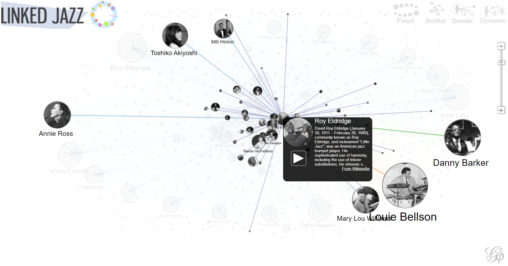

## Source

[The Semantic Lab at Pratt Institute, Linked Jazz. Accessed November 25th, 2022](https://linkedjazz.org/)

## Evaluation

The Linked Jazz Project aims to characterize the complete history of relationships between influential jazz musicians through the application of Linked Open Data technologies. Inherent in this goal is the investigation of primary sources (historical texts, interviews with other jazz musicians, etc.) to help construct the network of jazz musician relationships. The project exposes an API, which can be used to perform in-depth analysis, as well as a network visualization tool that visually represents the relationships between jazz musicians as a graph-like structure (see below):

In addition to these two tools, there is also a separate crowdsourcing platform called "Linked Jazz 52nd Street", which allows jazz music historians and other enthusiasts to characterize the types of relationships between different musicians.

Together, these three distinct tools represent the majority of the functionality of the Linked Jazz project. The kinds of questions that can be answered through this platform are chiefly analytical in nature, such as "Who were Duke Ellington's principal mentors?" or "Who were the top 5 jazz artists who collaborated with the most other artists?" General background information about each musician is also made readily available through integrations with Wikipedia and other sources, so the platform can also serve as a source of biographical information for lesser-known artists.

Regarding the strengths of the project, the network visualization tool is certainly quite impressive - it loads relatively quickly, and does not lag/stutter at all on my local machine. Furthermore, the video on the home page gave a very detailed (yet succinct) introduction to the project, highlighting key examples which demonstrate how the project can be useful.

Regarding its weaknesses, the main concerns I had with the project were the presence of dead links, such as the link to the API reference (which links to a "deprecated" page), as well as the "Read More" button, which results in a "Not Found" error. The presence of the dead links perhaps indicates that there is not sufficient maintenance occurring currently for this project. This might imply that some of the information on the website is outdated or inaccurate, which could potentially be problematic for researchers. Overall, however, this is certainly a minor nitpick, and the rest of the strengths of the project definitely solidify in my mind that this is a particularly robust project that could be very useful for jazz historians.
