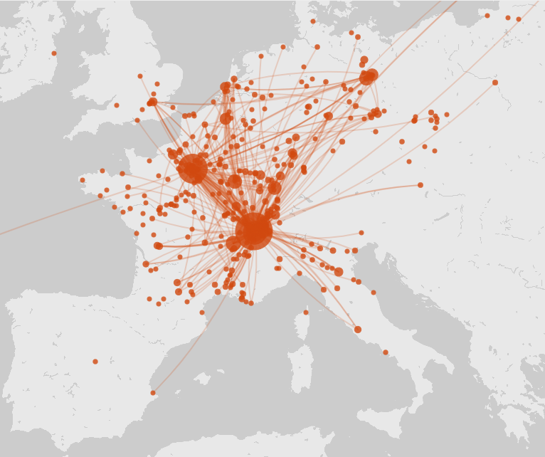
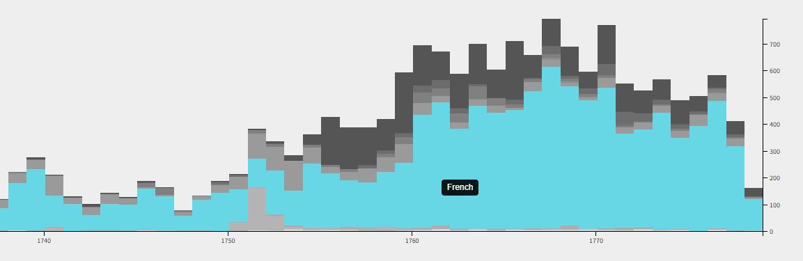

## Source

[Stanford University, Mapping the Republic of Letters. Accessed October 9th, 2022](http://republicofletters.stanford.edu/index.html)

## Evaluation

"Mapping the Republic of Letters" is a Stanford University project which aims to map out the various physical and social correspondence networks created by various academies which enabled the spread of scientific, political, philosophical, and personal ideas. The project aims to answer questions like "what did these networks look like?" and "how did they change over time?"

The project itself may be thought of primarily as a GIS, since it principally connects spatial data regarding the send/receive locations of various letters from particularly prolific individuals. An example of such a map for Voltaire, a French Enlightenment writer, can be seen below, where the size of each point reflects the number of letters sent and received from each location.

In addition to this interactive mapping of letters, which is termed a "correspondence network," several other informative visualizations can be found. For example, one particularly salient visualization was a timeline which reveals the frequency of letters sent over time, partitioned into language categories (see below).

Several of these networks and visualizations exist for a few key intellectual figures (including Votaire, Galileo, Benjamin Franklin, and more), which are extensively explored in "case study" analyses. While the depth of information included about each figure is impressive, there is little breadth in terms of the quantity of different people investigated through these case studies.

Some key strength of this project include the quality of the visualizations, which are (for the most part) interactive, utilize modern UI/UX design, and generally quite easy to understand, even with minimal background context. Furthermore, the "Publications" section of the website highlights several projects that have utilized the data visualizations and GIS information to high degrees of success, thus implying that this project is successful in advancing research dealing with the important figures who have a case study on this website.

However, there were also a few considerable weaknesses that were apparent in this project. Most notably, the visualizations themselves were often quite slow to load (sometimes taking up to a few minutes), which considerably hampers the user experience. Furthermore, some of the visualizations were difficult to interact with, as they would lag considerably when demanding inputs were given (like scrolling across a map). Clearly, there needs to be some kind of performance optimizations made, as it would appear that the visualization approach is not efficient enough to provide a fast and streamlined user experience. The visualization website cites that it utilizes a Stanford-built application called `Palladio`, which may not be sufficiently optimized for visualizing large numbers of data points.
