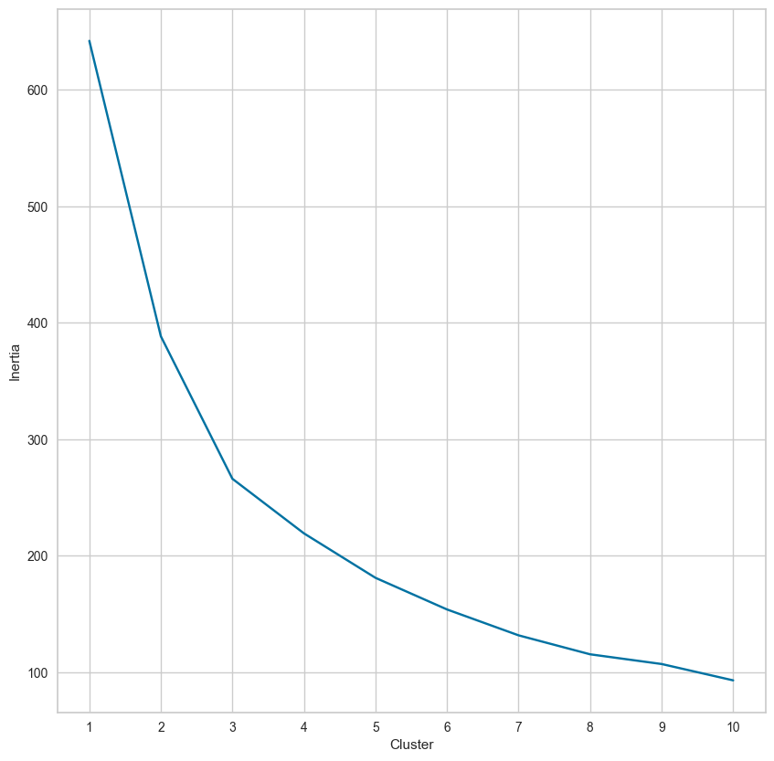
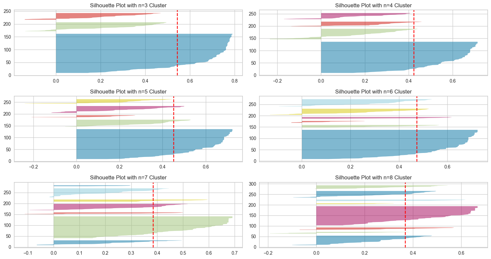
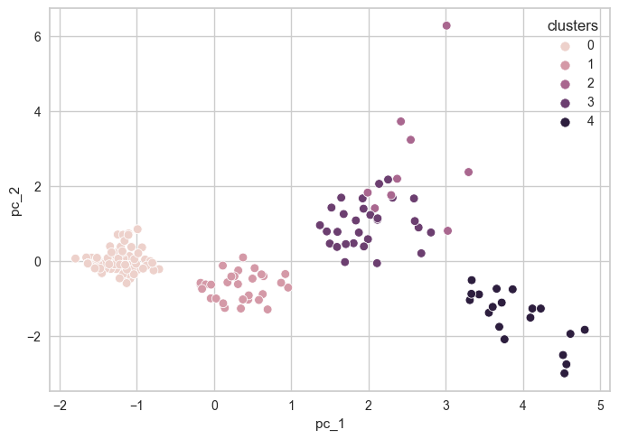
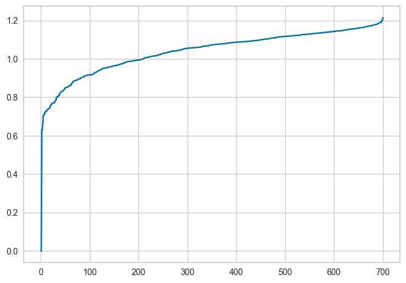

## Source

[Clustering with Scikit-Learn in Python](https://programminghistorian.org/en/lessons/clustering-with-scikit-learn-in-python#introduction)

## Reflection

Clustering is an unsupervised machine learning technique in which data samples are partitioned into distint clusters, typically based on some sort of distance metric. In this particular tutorial, the `scikit-learn` Python library was utilized to perform clustering on two distinct datasets: one containing information about ancient authors, and another containing abstracts of articles published in the [Religion](https://perma.cc/P4VN-6K9K) journal. Furthermore, two distinct clustering algorithms were utilized: k-means clustering, and the DBSCAN algorithm. The k-means algorithm takes as a parameter the number of clusters to partition the data into, chooses randomly-distributed cluster centers, then iteratively improves the cluster centers by minimizing the Euclidean distance from each point in the cluster to the cluster center. The DBSCAN algorithm, which stands for "Density-Based Spatial Clustering of Applications with Noise," searches for dense regions of data points, then classifies each point either into a cluster, or as an outlier.

The main point of applying these two clustering methods to these datasets was to show how clustering methods can be used to identify patterns and similarities between different data points. For example, the DBSCAN algorithm clustered many of the abstracts in the second dataset based off of the topical relevance of each abstract (the second cluster, for example, contained articles related to belief and atheism). This analysis elucidates how clustering algorithms can help researchers classify certain "types" of authors, works, and other content without explicitly creating these "type" categories themselves. As such, clustering algorithms provide a valuable mechanism for creating purely data-driven categorization schemes that might not suffer from the biases introduced by human-constructed categorizations. Furthermore, clustering models can be used in predictive contexts, where new data is fed into a clustering model, which can utilize previous data to classify the new data point into one of the existing clusters. Through this process, digital historians can learn more about novel data simply by utilizing existing data models (in tandem with clustering algorithms).

## Imports


```python
from sklearn.preprocessing import StandardScaler as SS # z-score standardization 
from sklearn.cluster import KMeans, DBSCAN # clustering algorithms
from sklearn.decomposition import PCA # dimensionality reduction
from sklearn.metrics import silhouette_score # used as a metric to evaluate the cohesion in a cluster
from sklearn.neighbors import NearestNeighbors # for selecting the optimal eps value when using DBSCAN
import numpy as np
import pandas as pd

# plotting libraries
import matplotlib.pyplot as plt
import seaborn as sns
from yellowbrick.cluster import SilhouetteVisualizer

# lemmatization libraries
import spacy
import re

# tf-idf vectorizer
from sklearn.feature_extraction.text import TfidfVectorizer
```

## Loading the Dataset


```python
# Fetch authors dataset from GitHub
authors_url = "https://raw.githubusercontent.com/programminghistorian/jekyll/gh-pages/assets/clustering-with-scikit-learn-in-python/data/DNP_ancient_authors.csv"
df_authors = pd.read_csv(authors_url,
                         index_col="authors").drop(columns=["Unnamed: 0"])

# display dataset structure with the pandas .info() method
print(df_authors.info())

# show first 5 rows
print(df_authors.head(5))

# display some statistics
print(df_authors.describe())
```

    <class 'pandas.core.frame.DataFrame'>
    Index: 238 entries, Achilles Tatius of Alexandria to Zosimus
    Data columns (total 8 columns):
     #   Column               Non-Null Count  Dtype
    ---  ------               --------------  -----
     0   word_count           238 non-null    int64
     1   modern_translations  238 non-null    int64
     2   known_works          238 non-null    int64
     3   manuscripts          238 non-null    int64
     4   early_editions       238 non-null    int64
     5   early_translations   238 non-null    int64
     6   modern_editions      238 non-null    int64
     7   commentaries         238 non-null    int64
    dtypes: int64(8)
    memory usage: 16.7+ KB
    None
                                                 word_count  modern_translations  \
    authors                                                                        
    Achilles Tatius of Alexandria                       383                    5   
    Aelianus Tacticus                                   350                    1   
    Aelianus, Claudius (Aelian)                         746                    8   
    Aelius Aristides (Publius Aelius Aristides)        2180                   26   
    Aeneas Tacticus                                     304                    5   
    
                                                 known_works  manuscripts  \
    authors                                                                 
    Achilles Tatius of Alexandria                          1            2   
    Aelianus Tacticus                                      1            0   
    Aelianus, Claudius (Aelian)                            3            6   
    Aelius Aristides (Publius Aelius Aristides)           22            7   
    Aeneas Tacticus                                        1            1   
    
                                                 early_editions  \
    authors                                                       
    Achilles Tatius of Alexandria                             3   
    Aelianus Tacticus                                         3   
    Aelianus, Claudius (Aelian)                              10   
    Aelius Aristides (Publius Aelius Aristides)              11   
    Aeneas Tacticus                                           1   
    
                                                 early_translations  \
    authors                                                           
    Achilles Tatius of Alexandria                                 9   
    Aelianus Tacticus                                             6   
    Aelianus, Claudius (Aelian)                                   8   
    Aelius Aristides (Publius Aelius Aristides)                   6   
    Aeneas Tacticus                                               2   
    
                                                 modern_editions  commentaries  
    authors                                                                     
    Achilles Tatius of Alexandria                              2             1  
    Aelianus Tacticus                                          1             0  
    Aelianus, Claudius (Aelian)                                7             0  
    Aelius Aristides (Publius Aelius Aristides)               15             1  
    Aeneas Tacticus                                            6             0  
            word_count  modern_translations  known_works  manuscripts  \
    count   238.000000           238.000000   238.000000   238.000000   
    mean    904.441176            12.970588     4.735294     4.512605   
    std     804.388666            16.553047     6.784297     4.637702   
    min      99.000000             0.000000     0.000000     0.000000   
    25%     448.750000             4.250000     1.000000     1.000000   
    50%     704.000000             9.000000     2.000000     3.000000   
    75%    1151.500000            15.750000     6.000000     6.000000   
    max    9406.000000           178.000000    65.000000    34.000000   
    
           early_editions  early_translations  modern_editions  commentaries  
    count      238.000000          238.000000       238.000000    238.000000  
    mean         5.823529            4.794118        10.399160      3.815126  
    std          4.250881            6.681706        11.652326      7.013509  
    min          0.000000            0.000000         0.000000      0.000000  
    25%          3.000000            0.000000         4.000000      0.000000  
    50%          5.000000            2.500000         7.000000      1.000000  
    75%          8.000000            8.000000        14.000000      4.000000  
    max         28.000000           39.000000       115.000000     43.000000  


```python
# Only keep those data points in our data frame with a word count within the
# 90th percentile range.
ninety_quantile = df_authors["word_count"].quantile(0.9)
df_authors = df_authors[df_authors["word_count"] <= ninety_quantile]
```

## Helper Functions


```python
def silhouettePlot(range_, data):
    ''' Helper function a silhouette plot that helps us to evaluate the cohesion
        in clusters (k-means only).
    '''
    half_length = int(len(range_)/2)
    range_list = list(range_)
    fig, ax = plt.subplots(half_length, 2, figsize=(15,8))
    for _ in range_:
        kmeans = KMeans(n_clusters=_, random_state=42)
        q, mod = divmod(_ - range_list[0], 2)
        sv = SilhouetteVisualizer(kmeans, colors="yellowbrick", ax=ax[q][mod])
        ax[q][mod].set_title("Silhouette Plot with n={} Cluster".format(_))
        sv.fit(data)
    fig.tight_layout()
    fig.show()
    fig.savefig("silhouette_plot.png")
```


```python
def elbowPlot(range_, data, figsize=(10,10)):
    ''' The elbow plot function helps to figure out the right amount of clusters
        for a dataset.
    '''
    inertia_list = []
    for n in range_:
        kmeans = KMeans(n_clusters=n, random_state=42)
        kmeans.fit(data)
        inertia_list.append(kmeans.inertia_)
        
    # plotting
    fig = plt.figure(figsize=figsize)
    ax = fig.add_subplot(111)
    sns.lineplot(y=inertia_list, x=range_, ax=ax)
    ax.set_xlabel("Cluster")
    ax.set_ylabel("Inertia")
    ax.set_xticks(list(range_))
    fig.show()
    fig.savefig("elbow_plot.png")
```


```python
def findOptimalEps(n_neighbors, data):
    ''' Finds the optimal eps distance when using DBSCAN.
    '''
    neigh = NearestNeighbors(n_neighbors=n_neighbors)
    nbrs = neigh.fit(data)
    distances, indices = nbrs.kneighbors(data)
    distances = np.sort(distances, axis=0)
    distances = distances[:,1]
    plt.plot(distances)
```


```python
def progressiveFeatureSelection(df, n_clusters=3, max_features=4,):
    ''' Very basic implementation of an algorithm for feature selection
        (unsupervised clustering).
    '''
    feature_list = list(df.columns)
    selected_features = list()
    # select starting feature
    initial_feature = ""
    high_score = 0
    for feature in feature_list:
        kmeans = KMeans(n_clusters=n_clusters, random_state=42)
        data_ = df[feature]
        labels = kmeans.fit_predict(data_.to_frame())
        score_ = silhouette_score(data_.to_frame(), labels)
        print("Proposed new feature {} with score {}".format(feature, score_))
        if score_ >= high_score:
            initial_feature = feature
            high_score = score_
    print("The initial feature is {} with a silhouette score of {}.".format(initial_feature, high_score))
    feature_list.remove(initial_feature)
    selected_features.append(initial_feature)
    for _ in range(max_features-1):
        high_score = 0
        selected_feature = ""
        print("Starting selection {}...".format(_))
        for feature in feature_list:
            selection_ = selected_features.copy()
            selection_.append(feature)
            kmeans = KMeans(n_clusters=n_clusters, random_state=42)
            data_ = df[selection_]
            labels = kmeans.fit_predict(data_)
            score_ = silhouette_score(data_, labels)
            print("Proposed new feature {} with score {}".format(feature, score_))
            if score_ > high_score:
                selected_feature = feature
                high_score = score_
        selected_features.append(selected_feature)
        feature_list.remove(selected_feature)
        print("Selected new feature {} with score {}".format(selected_feature, high_score))
    return selected_features
```

## Standardizing the DNP Ancient Authors Dataset


```python
scaler = SS()
DNP_authors_standardized = scaler.fit_transform(df_authors)
df_authors_standardized = pd.DataFrame(DNP_authors_standardized,
                                       columns=["word_count_standardized",
                                                "modern_translations_standardized",
                                                "known_works_standardized",
                                                "manuscripts_standardized",
                                                "early_editions_standardized",
                                                "early_translations_standardized",
                                                "modern_editions_standardized",
                                                "commentaries_standardized"])
df_authors_standardized = df_authors_standardized.set_index(df_authors.index)
```

## Feature Selection (using helper function)


```python
selected_features = progressiveFeatureSelection(df_authors_standardized, max_features=3, n_clusters=3)
df_standardized_sliced = df_authors_standardized[selected_features]
```

    Proposed new feature word_count_standardized with score 0.5815823896749474
    Proposed new feature modern_translations_standardized with score 0.592449382653205
    Proposed new feature known_works_standardized with score 0.7606223362466435
    Proposed new feature manuscripts_standardized with score 0.6193716240205519
    Proposed new feature early_editions_standardized with score 0.6054575587243932
    Proposed new feature early_translations_standardized with score 0.7025924996773049
    Proposed new feature modern_editions_standardized with score 0.6267499859538754
    Proposed new feature commentaries_standardized with score 0.7635590362947628
    The initial feature is commentaries_standardized with a silhouette score of 0.7635590362947628.
    Starting selection 0...
    Proposed new feature word_count_standardized with score 0.49823573315720454
    Proposed new feature modern_translations_standardized with score 0.48709861763555096
    Proposed new feature known_works_standardized with score 0.6248907484676766
    Proposed new feature manuscripts_standardized with score 0.4990467101238413
    Proposed new feature early_editions_standardized with score 0.486228428741611
    Proposed new feature early_translations_standardized with score 0.5733248510427374
    Proposed new feature modern_editions_standardized with score 0.5746359517651854
    Selected new feature known_works_standardized with score 0.6248907484676766
    Starting selection 1...
    Proposed new feature word_count_standardized with score 0.5146900270599629
    Proposed new feature modern_translations_standardized with score 0.5115607116954545
    Proposed new feature manuscripts_standardized with score 0.48236942054347287
    Proposed new feature early_editions_standardized with score 0.4292187272499715
    Proposed new feature early_translations_standardized with score 0.4860441014648876
    Proposed new feature modern_editions_standardized with score 0.5434584440130673
    Selected new feature modern_editions_standardized with score 0.5434584440130673


## Choosing the Right Amount of Clusters


```python
# Make an elbow plot to help figure out the optimal number of clusters
elbowPlot(range(1,11), df_standardized_sliced)
```

    /tmp/ipykernel_3475/2244077218.py:18: UserWarning: Matplotlib is currently using module://matplotlib_inline.backend_inline, which is a non-GUI backend, so cannot show the figure.
      fig.show()


    

    


```python
# Make a silhouette plot to get more information
silhouettePlot(range(3,9), df_standardized_sliced)
```

    /tmp/ipykernel_3475/1147043436.py:15: UserWarning: Matplotlib is currently using module://matplotlib_inline.backend_inline, which is a non-GUI backend, so cannot show the figure.
      fig.show()


    

    


From the above silhouette plot, it would appear that n=5 or n=3 are good choices, since the knives are relatively sharp.

## K-Means Analysis of the DNP Ancient Authors Dataset (n=5)


```python
kmeans = KMeans(n_clusters=5, random_state=42)
cluster_labels = kmeans.fit_predict(df_standardized_sliced)
df_standardized_sliced["clusters"] = cluster_labels
```

    /tmp/ipykernel_3475/2295879936.py:3: SettingWithCopyWarning: 
    A value is trying to be set on a copy of a slice from a DataFrame.
    Try using .loc[row_indexer,col_indexer] = value instead
    
    See the caveats in the documentation: https://pandas.pydata.org/pandas-docs/stable/user_guide/indexing.html#returning-a-view-versus-a-copy
      df_standardized_sliced["clusters"] = cluster_labels


## PCA Dimensionality Reduction and Plot


```python
# dimensionality reduction with PCA
pca = PCA(n_components=2, whiten=False, random_state=42)
authors_standardized_pca = pca.fit_transform(df_standardized_sliced)
df_authors_standardized_pca = pd.DataFrame(data=authors_standardized_pca, columns=["pc_1", "pc_2"])
df_authors_standardized_pca["clusters"] = cluster_labels

# plotting the clusters with seaborn
sns.scatterplot(x="pc_1", y="pc_2", hue="clusters", data=df_authors_standardized_pca)
```


    <AxesSubplot: xlabel='pc_1', ylabel='pc_2'>


    

    


# Dataset 2: Religion Abstracts


```python
abstracts_url = "https://raw.githubusercontent.com/programminghistorian/jekyll/gh-pages/assets/clustering-with-scikit-learn-in-python/data/RELIGION_abstracts.csv"
df_abstracts = pd.read_csv(abstracts_url).drop(columns="Unnamed: 0")
df_abstracts.info()
df_abstracts.describe()
```

    <class 'pandas.core.frame.DataFrame'>
    RangeIndex: 701 entries, 0 to 700
    Data columns (total 4 columns):
     #   Column    Non-Null Count  Dtype 
    ---  ------    --------------  ----- 
     0   title     701 non-null    object
     1   abstract  701 non-null    object
     2   link      701 non-null    object
     3   volume    701 non-null    object
    dtypes: object(4)
    memory usage: 22.0+ KB


<div>
<style scoped>
    .dataframe tbody tr th:only-of-type {
        vertical-align: middle;
    }

    .dataframe tbody tr th {
        vertical-align: top;
    }

    .dataframe thead th {
        text-align: right;
    }
</style>
<table border="1" class="dataframe">
  <thead>
    <tr style="text-align: right;">
      <th></th>
      <th>title</th>
      <th>abstract</th>
      <th>link</th>
      <th>volume</th>
    </tr>
  </thead>
  <tbody>
    <tr>
      <th>count</th>
      <td>701</td>
      <td>701</td>
      <td>701</td>
      <td>701</td>
    </tr>
    <tr>
      <th>unique</th>
      <td>701</td>
      <td>701</td>
      <td>701</td>
      <td>40</td>
    </tr>
    <tr>
      <th>top</th>
      <td>Norwegian Muslims denouncing terrorism: beyond...</td>
      <td>In contemporary European societies, Muslims ar...</td>
      <td>https://www.tandfonline.com/doi/full/10.1080/0...</td>
      <td>https://www.tandfonline.com/loi/rrel20?treeId=...</td>
    </tr>
    <tr>
      <th>freq</th>
      <td>1</td>
      <td>1</td>
      <td>1</td>
      <td>41</td>
    </tr>
  </tbody>
</table>
</div>


## Lemmatization Helper Function


```python
# lemmatization (optional step)
nlp = spacy.load("en_core_web_sm")

def lemmatizeAbstracts(x):
    doc = nlp(x)
    new_text = []
    for token in doc:
        new_text.append(token.lemma_)
    text_string = " ".join(new_text)
    # getting rid of non-word characters
    text_string = re.sub(r"[^\w\s]+", "", text_string)
    text_string = re.sub(r"\s{2,}", " ", text_string)
    return text_string

df_abstracts["abstract_lemma"] = df_abstracts["abstract"].apply(lemmatizeAbstracts)
df_abstracts.to_csv("data/RELIGION_abstracts_lemmatized.csv")
```

## TF-IDF Vectorization


```python
tfidf = TfidfVectorizer(stop_words="english")
df_abstracts_tfidf = tfidf.fit_transform(df_abstracts["abstract_lemma"])
```


```python
# creating a new TF-IDF matrix
tfidf = TfidfVectorizer(stop_words="english", ngram_range=(1,2), max_features=250, strip_accents="unicode", min_df=10, max_df=200)
tfidf_religion_array = tfidf.fit_transform(df_abstracts["abstract_lemma"])
df_abstracts_tfidf = pd.DataFrame(tfidf_religion_array.toarray(), index=df_abstracts.index, columns=tfidf.get_feature_names_out())
df_abstracts_tfidf.describe()
```


<div>
<style scoped>
    .dataframe tbody tr th:only-of-type {
        vertical-align: middle;
    }

    .dataframe tbody tr th {
        vertical-align: top;
    }

    .dataframe thead th {
        text-align: right;
    }
</style>
<table border="1" class="dataframe">
  <thead>
    <tr style="text-align: right;">
      <th></th>
      <th>academic</th>
      <th>account</th>
      <th>activity</th>
      <th>address</th>
      <th>african</th>
      <th>agency</th>
      <th>aim</th>
      <th>allow</th>
      <th>american</th>
      <th>analyse</th>
      <th>...</th>
      <th>use</th>
      <th>value</th>
      <th>various</th>
      <th>view</th>
      <th>way</th>
      <th>western</th>
      <th>woman</th>
      <th>work</th>
      <th>world</th>
      <th>year</th>
    </tr>
  </thead>
  <tbody>
    <tr>
      <th>count</th>
      <td>701.000000</td>
      <td>701.000000</td>
      <td>701.000000</td>
      <td>701.000000</td>
      <td>701.000000</td>
      <td>701.000000</td>
      <td>701.000000</td>
      <td>701.000000</td>
      <td>701.000000</td>
      <td>701.000000</td>
      <td>...</td>
      <td>701.000000</td>
      <td>701.000000</td>
      <td>701.000000</td>
      <td>701.000000</td>
      <td>701.000000</td>
      <td>701.000000</td>
      <td>701.000000</td>
      <td>701.000000</td>
      <td>701.000000</td>
      <td>701.000000</td>
    </tr>
    <tr>
      <th>mean</th>
      <td>0.017407</td>
      <td>0.017756</td>
      <td>0.010633</td>
      <td>0.011059</td>
      <td>0.011356</td>
      <td>0.009061</td>
      <td>0.010451</td>
      <td>0.009127</td>
      <td>0.015210</td>
      <td>0.011713</td>
      <td>...</td>
      <td>0.033074</td>
      <td>0.014268</td>
      <td>0.013633</td>
      <td>0.021310</td>
      <td>0.027744</td>
      <td>0.021257</td>
      <td>0.018406</td>
      <td>0.028048</td>
      <td>0.028877</td>
      <td>0.014563</td>
    </tr>
    <tr>
      <th>std</th>
      <td>0.063839</td>
      <td>0.067667</td>
      <td>0.051894</td>
      <td>0.047114</td>
      <td>0.065659</td>
      <td>0.053946</td>
      <td>0.045080</td>
      <td>0.042445</td>
      <td>0.068153</td>
      <td>0.051143</td>
      <td>...</td>
      <td>0.074190</td>
      <td>0.061468</td>
      <td>0.052642</td>
      <td>0.064568</td>
      <td>0.062593</td>
      <td>0.078245</td>
      <td>0.095377</td>
      <td>0.074917</td>
      <td>0.073751</td>
      <td>0.052971</td>
    </tr>
    <tr>
      <th>min</th>
      <td>0.000000</td>
      <td>0.000000</td>
      <td>0.000000</td>
      <td>0.000000</td>
      <td>0.000000</td>
      <td>0.000000</td>
      <td>0.000000</td>
      <td>0.000000</td>
      <td>0.000000</td>
      <td>0.000000</td>
      <td>...</td>
      <td>0.000000</td>
      <td>0.000000</td>
      <td>0.000000</td>
      <td>0.000000</td>
      <td>0.000000</td>
      <td>0.000000</td>
      <td>0.000000</td>
      <td>0.000000</td>
      <td>0.000000</td>
      <td>0.000000</td>
    </tr>
    <tr>
      <th>25%</th>
      <td>0.000000</td>
      <td>0.000000</td>
      <td>0.000000</td>
      <td>0.000000</td>
      <td>0.000000</td>
      <td>0.000000</td>
      <td>0.000000</td>
      <td>0.000000</td>
      <td>0.000000</td>
      <td>0.000000</td>
      <td>...</td>
      <td>0.000000</td>
      <td>0.000000</td>
      <td>0.000000</td>
      <td>0.000000</td>
      <td>0.000000</td>
      <td>0.000000</td>
      <td>0.000000</td>
      <td>0.000000</td>
      <td>0.000000</td>
      <td>0.000000</td>
    </tr>
    <tr>
      <th>50%</th>
      <td>0.000000</td>
      <td>0.000000</td>
      <td>0.000000</td>
      <td>0.000000</td>
      <td>0.000000</td>
      <td>0.000000</td>
      <td>0.000000</td>
      <td>0.000000</td>
      <td>0.000000</td>
      <td>0.000000</td>
      <td>...</td>
      <td>0.000000</td>
      <td>0.000000</td>
      <td>0.000000</td>
      <td>0.000000</td>
      <td>0.000000</td>
      <td>0.000000</td>
      <td>0.000000</td>
      <td>0.000000</td>
      <td>0.000000</td>
      <td>0.000000</td>
    </tr>
    <tr>
      <th>75%</th>
      <td>0.000000</td>
      <td>0.000000</td>
      <td>0.000000</td>
      <td>0.000000</td>
      <td>0.000000</td>
      <td>0.000000</td>
      <td>0.000000</td>
      <td>0.000000</td>
      <td>0.000000</td>
      <td>0.000000</td>
      <td>...</td>
      <td>0.000000</td>
      <td>0.000000</td>
      <td>0.000000</td>
      <td>0.000000</td>
      <td>0.000000</td>
      <td>0.000000</td>
      <td>0.000000</td>
      <td>0.000000</td>
      <td>0.000000</td>
      <td>0.000000</td>
    </tr>
    <tr>
      <th>max</th>
      <td>0.493789</td>
      <td>0.709637</td>
      <td>0.509307</td>
      <td>0.360085</td>
      <td>0.737092</td>
      <td>0.658383</td>
      <td>0.359469</td>
      <td>0.409185</td>
      <td>0.617276</td>
      <td>0.457299</td>
      <td>...</td>
      <td>0.609089</td>
      <td>0.828761</td>
      <td>0.534004</td>
      <td>0.515410</td>
      <td>0.364839</td>
      <td>0.724760</td>
      <td>0.941362</td>
      <td>0.604694</td>
      <td>0.492094</td>
      <td>0.365748</td>
    </tr>
  </tbody>
</table>
<p>8 rows × 250 columns</p>
</div>


## PCA Dimensionality Reduction


```python
pca = PCA(n_components=10, whiten=False, random_state=42)
abstracts_pca = pca.fit_transform(df_abstracts_tfidf)
df_abstracts_pca = pd.DataFrame(data=abstracts_pca)
```

## Applying K-Means Clustering


```python
kmeans = KMeans(n_clusters=100, random_state=42)
abstracts_labels = kmeans.fit_predict(df_abstracts_pca)
df_abstracts_labeled = df_abstracts.copy()
df_abstracts_labeled["cluster"] = abstracts_labels
```

We can display some elements of the clusters to see what kinds of abstracts were clustered together:


```python
df_abstracts_labeled[df_abstracts_labeled["cluster"] == 75][["title", "cluster"]]
```


<div>
<style scoped>
    .dataframe tbody tr th:only-of-type {
        vertical-align: middle;
    }

    .dataframe tbody tr th {
        vertical-align: top;
    }

    .dataframe thead th {
        text-align: right;
    }
</style>
<table border="1" class="dataframe">
  <thead>
    <tr style="text-align: right;">
      <th></th>
      <th>title</th>
      <th>cluster</th>
    </tr>
  </thead>
  <tbody>
    <tr>
      <th>28</th>
      <td>The space between us: considering online media...</td>
      <td>75</td>
    </tr>
    <tr>
      <th>39</th>
      <td>Towards increasing diversity in the study of r...</td>
      <td>75</td>
    </tr>
    <tr>
      <th>61</th>
      <td>Qur’anic terminology, translation, and the Isl...</td>
      <td>75</td>
    </tr>
    <tr>
      <th>88</th>
      <td>From nation-state to market: The transformatio...</td>
      <td>75</td>
    </tr>
    <tr>
      <th>243</th>
      <td>More than belief, but not more than belief and...</td>
      <td>75</td>
    </tr>
    <tr>
      <th>279</th>
      <td>The role of evolutionary psychology within an ...</td>
      <td>75</td>
    </tr>
    <tr>
      <th>389</th>
      <td>A case of misrepresentation: James L. Cox and ...</td>
      <td>75</td>
    </tr>
    <tr>
      <th>436</th>
      <td>Epidemiology and the study of religion</td>
      <td>75</td>
    </tr>
    <tr>
      <th>682</th>
      <td>The theological enemies of religious studies</td>
      <td>75</td>
    </tr>
  </tbody>
</table>
</div>


```python
df_abstracts_labeled[df_abstracts_labeled["cluster"] == 15][["title", "cluster"]]
```


<div>
<style scoped>
    .dataframe tbody tr th:only-of-type {
        vertical-align: middle;
    }

    .dataframe tbody tr th {
        vertical-align: top;
    }

    .dataframe thead th {
        text-align: right;
    }
</style>
<table border="1" class="dataframe">
  <thead>
    <tr style="text-align: right;">
      <th></th>
      <th>title</th>
      <th>cluster</th>
    </tr>
  </thead>
  <tbody>
    <tr>
      <th>8</th>
      <td>Engineering self and civil society: the promis...</td>
      <td>15</td>
    </tr>
    <tr>
      <th>139</th>
      <td>Contemporary fantasy fiction and representatio...</td>
      <td>15</td>
    </tr>
    <tr>
      <th>152</th>
      <td>Socialist religion and the emergence of occult...</td>
      <td>15</td>
    </tr>
    <tr>
      <th>474</th>
      <td>Orisha Worship Communities: A Reconsideration ...</td>
      <td>15</td>
    </tr>
    <tr>
      <th>609</th>
      <td>Cultural continuity and cultural hegemony: Ita...</td>
      <td>15</td>
    </tr>
  </tbody>
</table>
</div>


```python
df_abstracts_labeled[df_abstracts_labeled["cluster"] == 84][["title", "cluster"]]
```


<div>
<style scoped>
    .dataframe tbody tr th:only-of-type {
        vertical-align: middle;
    }

    .dataframe tbody tr th {
        vertical-align: top;
    }

    .dataframe thead th {
        text-align: right;
    }
</style>
<table border="1" class="dataframe">
  <thead>
    <tr style="text-align: right;">
      <th></th>
      <th>title</th>
      <th>cluster</th>
    </tr>
  </thead>
  <tbody>
    <tr>
      <th>58</th>
      <td>The promise of the universal: non-Buddhists’ a...</td>
      <td>84</td>
    </tr>
    <tr>
      <th>246</th>
      <td>Where angels fear to tread: neurophenomenology...</td>
      <td>84</td>
    </tr>
    <tr>
      <th>275</th>
      <td>On the market: consumption and material cultur...</td>
      <td>84</td>
    </tr>
    <tr>
      <th>624</th>
      <td>Contemporary Theravāda and Zen Buddhist attitu...</td>
      <td>84</td>
    </tr>
  </tbody>
</table>
</div>


## Applying DBSCAN Clustering


```python
findOptimalEps(2, df_abstracts_tfidf)
```


    

    


```python
# Training the DBSCAN model
dbscan = DBSCAN(eps=0.2, metric="euclidean")
dbscan_labels = dbscan.fit_predict(df_abstracts_pca)
df_abstracts_dbscan = df_abstracts.copy()
df_abstracts_dbscan["cluster"] = dbscan_labels
df_abstracts_dbscan["cluster"].unique()
```


    array([ 0,  1, -1,  2,  3])


We can display some elements of the clusters:


```python
df_abstracts_dbscan[df_abstracts_dbscan["cluster"] == 1][["title", "cluster"]]
```


<div>
<style scoped>
    .dataframe tbody tr th:only-of-type {
        vertical-align: middle;
    }

    .dataframe tbody tr th {
        vertical-align: top;
    }

    .dataframe thead th {
        text-align: right;
    }
</style>
<table border="1" class="dataframe">
  <thead>
    <tr style="text-align: right;">
      <th></th>
      <th>title</th>
      <th>cluster</th>
    </tr>
  </thead>
  <tbody>
    <tr>
      <th>14</th>
      <td>Imagining Buddhist modernism: the shared relig...</td>
      <td>1</td>
    </tr>
    <tr>
      <th>20</th>
      <td>Why Durkheim really thought that Buddhism was ...</td>
      <td>1</td>
    </tr>
    <tr>
      <th>158</th>
      <td>Textbook Buddhism: introductory books on the B...</td>
      <td>1</td>
    </tr>
    <tr>
      <th>439</th>
      <td>Recent trends in Sri Lankan Buddhism</td>
      <td>1</td>
    </tr>
    <tr>
      <th>471</th>
      <td>William James and Buddhism: American Pragmatis...</td>
      <td>1</td>
    </tr>
    <tr>
      <th>559</th>
      <td>Buddhist Environmental Ethics and Detraditiona...</td>
      <td>1</td>
    </tr>
    <tr>
      <th>620</th>
      <td>Buddhadharma and contemporary ethics</td>
      <td>1</td>
    </tr>
    <tr>
      <th>631</th>
      <td>How environmentalist is Buddhism?</td>
      <td>1</td>
    </tr>
    <tr>
      <th>638</th>
      <td>Protestant Buddhism?</td>
      <td>1</td>
    </tr>
    <tr>
      <th>690</th>
      <td>Burial ‘ad sanctos’ and the physical presence ...</td>
      <td>1</td>
    </tr>
  </tbody>
</table>
</div>


```python
df_abstracts_dbscan[df_abstracts_dbscan["cluster"] == 2][["title", "cluster"]]
```


<div>
<style scoped>
    .dataframe tbody tr th:only-of-type {
        vertical-align: middle;
    }

    .dataframe tbody tr th {
        vertical-align: top;
    }

    .dataframe thead th {
        text-align: right;
    }
</style>
<table border="1" class="dataframe">
  <thead>
    <tr style="text-align: right;">
      <th></th>
      <th>title</th>
      <th>cluster</th>
    </tr>
  </thead>
  <tbody>
    <tr>
      <th>288</th>
      <td>Wither or whither: the study of religion at th...</td>
      <td>2</td>
    </tr>
    <tr>
      <th>289</th>
      <td>Contextualization of Religious Studies and of ...</td>
      <td>2</td>
    </tr>
    <tr>
      <th>584</th>
      <td>The academic study of Buddhism in the United S...</td>
      <td>2</td>
    </tr>
    <tr>
      <th>681</th>
      <td>Postulations for safeguarding preconceptions: ...</td>
      <td>2</td>
    </tr>
  </tbody>
</table>
</div>


