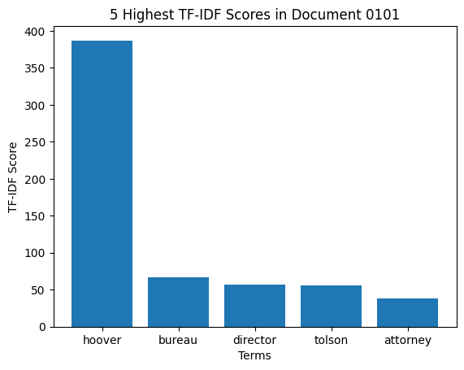
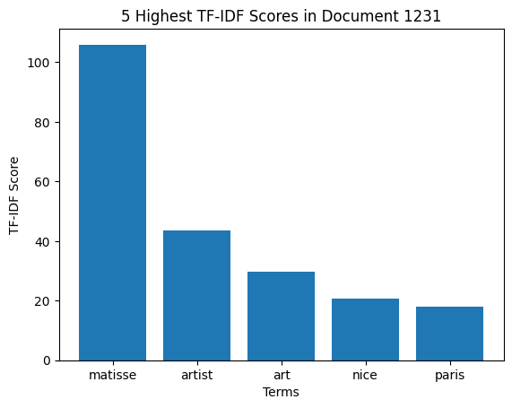

## Source

[Analyzing Documents with TF-IDF](https://programminghistorian.org/en/lessons/analyzing-documents-with-tfidf)

## Reflection

The goal of this Programming Historian lesson was to highlight the Term Frequency - Inverse Document Frequency (TF-IDF) technique for performing information retrieval on textual data. TF-IDF is a scalar statistical metric that roughly evaluates how "relevant" a word is to a particular document by taking the product of the frequency of that word in the particular document with the inverse of its frequency across a selected set of documents. Terms with the highest TF-IDF scores are the terms in a document which are distinctively frequent in that document alone, as compared to the other documents in the chosen collection.

To utilize TF-IDF scores, a convenient implementation of the computational algorithm can be found in the `scikit-learn` library, which makes it very straightforward to analyze a collection of documents using TF-IDF scores. Once the scores have been computed, several forms of analysis can be subsequently utilized. For example, one could visualize each document by plotting the words with the highest TF-IDF scores (as was done at the end of this notebook). Another form of analysis could be the computation of textual similarity by comparing the TF-IDF scores of each document in the collection through some distance or similarity metric (like Euclidean distance) to determine how similar two documents are. Finally, another common use case for TF-IDF scores is as preprocessing for machine learning models, which can benefit from using numerical TF-IDF scores as input as opposed to raw textual data.

## Imports

```python
from pathlib import Path
# import the TfidfVectorizer from Scikit-Learn.
from sklearn.feature_extraction.text import TfidfVectorizer
import pandas as pd
import matplotlib.pyplot as plt
```

## Loading the dataset

The dataset consists of 366 New York Times historic obituaries scraped from <https://archive.nytimes.com/www.nytimes.com/learning/general/onthisday/>. On each day of the year, The New York Times featured an obituary of someone born on that day.

```python
all_txt_files =[]
for file in Path("./lesson-files/txt").rglob("*.txt"):
     all_txt_files.append(file.parent / file.name)
# counts the length of the list
n_files = len(all_txt_files)
print(n_files)
```

    366

```python
all_txt_files.sort()
all_txt_files[0]
```

    PosixPath('lesson-files/txt/0101.txt')

## Loading text files into memory

```python
all_docs = []
for txt_file in all_txt_files:
    with open(txt_file) as f:
        txt_file_as_string = f.read()
    all_docs.append(txt_file_as_string)
```

## Performing TF-IDF calculations with `sklearn`

```python
vectorizer = TfidfVectorizer(max_df=.65, min_df=1, stop_words=None,
                             use_idf=True, norm=None)
transformed_documents = vectorizer.fit_transform(all_docs)
```

```python
transformed_documents_as_array = transformed_documents.toarray()
# use this line of code to verify that the numpy array represents the same number of documents that we have in the file list
len(transformed_documents_as_array)
```

    366

## Creating TF-IDF dataframes for each article

```python
# make the output folder if it doesn't already exist
output_dir = Path("./tf_idf_output")
output_dir.mkdir(parents=True, exist_ok=True)

# construct a list of output file paths using the previous list of text files the relative path for tf_idf_output
# output_filenames = [str(txt_file).replace(".txt", ".csv").replace("txt/", "tf_idf_output/") for txt_file in all_txt_files]

# loop each item in transformed_documents_as_array, using enumerate to keep track of the current position
for counter, doc in enumerate(transformed_documents_as_array):
    # construct a dataframe
    tf_idf_tuples = list(zip(vectorizer.get_feature_names_out(), doc))
    one_doc_as_df = pd.DataFrame.from_records(tf_idf_tuples, columns=['term', 'score']).sort_values(by='score', ascending=False).reset_index(drop=True)

    # output to a csv using the enumerated value for the filename
    # one_doc_as_df.to_csv(output_filenames[counter])
    new_filename = output_dir / all_txt_files[counter].name.replace(".txt", ".csv")
    one_doc_as_df.to_csv(new_filename)
```

## Extra analysis: plotting TF-IDF results

We can plot the top 5 terms with the highest TF-IDF scores for a few select documents using the following function.

```python
def plot_5_highest(csv_path):
    path = Path(csv_path)
    doc_df = pd.read_csv(path)
    highest_5 = doc_df.nlargest(5, "score")
    plt.bar(highest_5["term"], highest_5["score"])
    plt.title(f"5 Highest TF-IDF Scores in Document {path.stem}")
    plt.xlabel("Terms")
    plt.ylabel("TF-IDF Score")
    plt.show()
```

```python
plot_5_highest("./tf_idf_output/0101.csv")
```



```python
plot_5_highest("./tf_idf_output/1218.csv")
```


```python
plot_5_highest("./tf_idf_output/1231.csv")
```



We can see that the distribution of terms in these three examples are relatively similar: the first word has a far higher TF-IDF score than the other four words.
