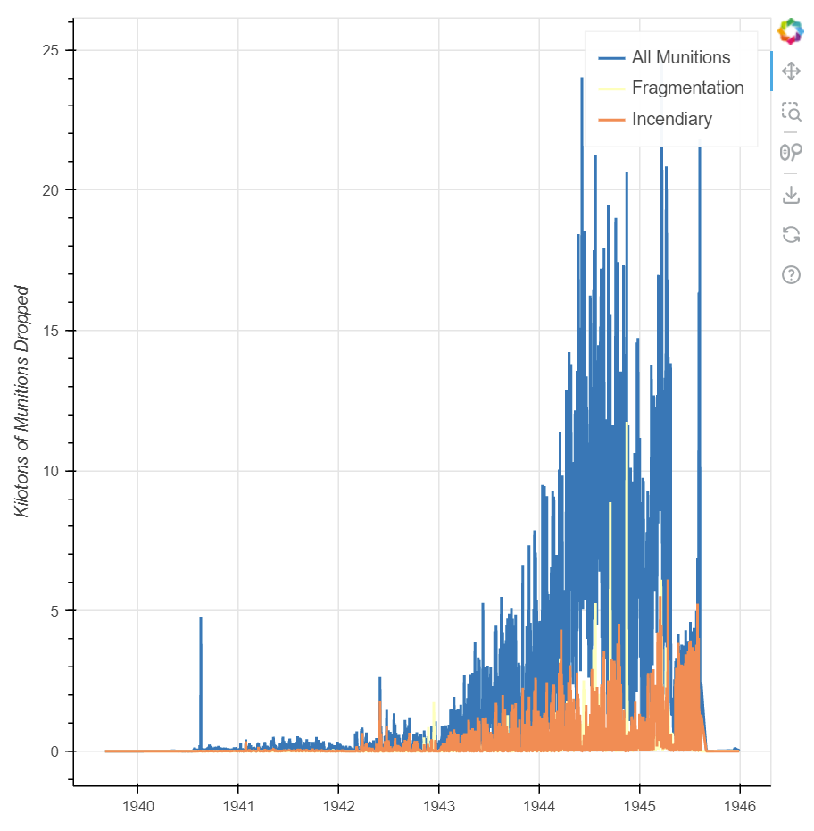
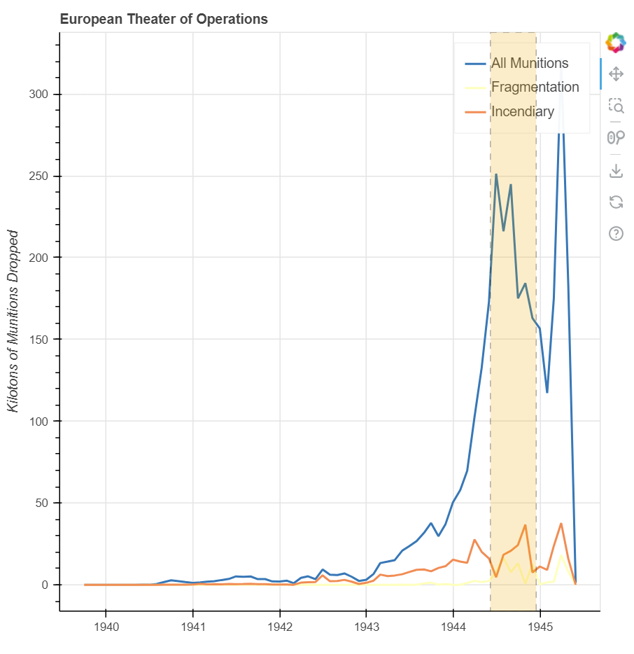

## Source

[Visualizing Data with Bokeh and Pandas](https://programminghistorian.org/en/lessons/visualizing-with-bokeh)

## Reflection

This lesson utilized the Bokeh data visualization library to create several different interactive plots, including bar graphs, time-series graphs, and geographical distributions. Data processing was done through the Pandas library, which includes several key functions for working with data at scale. The dataset utilized was the THOR WWII dataset, which principally contained information about bombings throughout World War II. The key goals in this analysis were to visually answer different types of questions that can be asked about this particular dataset, including the frequency of bombings over time, the breakdown of different types of munitions, and the geographical distribution of bombing sites.

Most of the plotting techniques utilized were relatively straightforward, as the goal of this analysis was principally to learn the basic functionality of the Bokeh and Pandas libraries. Examples of skills covered included aggregating data using the `groupby` and `sum` methods, coloring bar graphs with a specific colormap, resampling time-series data by constructing a custom Pandas `Grouper` object, and converting from latitude/longitude to easting/northing notation for the geographical distribution plot. For datasets other than the THOR WWII dataset, these generalizable techniques can easily be applied to other datasets, especially those with scalar statistical columns and geographical data. In fact, the tutorial itself even provides three separate datasets which could easily be visualized with Bokeh and Pandas.

## Imports

```python
import pandas as pd
from datetime import datetime
from bokeh.plotting import figure, output_file, show
from bokeh.models import ColumnDataSource, BoxAnnotation, Range1d
from bokeh.layouts import layout
from bokeh.models.tools import HoverTool
from bokeh.palettes import Spectral5, Spectral3
from bokeh.transform import factor_cmap
from bokeh.tile_providers import get_provider
from pyproj import Transformer
```

    BokehDeprecationWarning: tile_providers module was deprecated in Bokeh 3.0.0 and will be removed, use add_tile directly instead.

## Downloading the Dataset

```python
!wget https://raw.githubusercontent.com/programminghistorian/ph-submissions/gh-pages/assets/visualizing-with-bokeh/thor_wwii.csv
```

    --2022-11-26 03:00:34--  https://raw.githubusercontent.com/programminghistorian/ph-submissions/gh-pages/assets/visualizing-with-bokeh/thor_wwii.csv
    Resolving raw.githubusercontent.com (raw.githubusercontent.com)... 185.199.110.133, 185.199.111.133, 185.199.108.133, ...
    Connecting to raw.githubusercontent.com (raw.githubusercontent.com)|185.199.110.133|:443... connected.
    HTTP request sent, awaiting response... 200 OK
    Length: 16124275 (15M) [text/plain]
    Saving to: ‘thor_wwii.csv’
    
    thor_wwii.csv       100%[===================>]  15.38M  22.3MB/s    in 0.7s    
    
    2022-11-26 03:00:35 (22.3 MB/s) - ‘thor_wwii.csv’ saved [16124275/16124275]

## Example: first Bokeh plot

```python
output_file('my_first_graph.html')
```

```python
x = [1, 3, 5, 7]
y = [2, 4, 6, 8]

p = figure()

p.circle(x, y, size=10, color='red', legend_label='circle')
p.line(x, y, color='blue', legend_label='line')
p.triangle(y, x, color='gold', size=10, legend_label='triangle')
p.legend.click_policy='hide'
```

```python
show(p)
```


## Loading the WWII Dataset with Pandas

```python
df = pd.read_csv('thor_wwii.csv')
df
```

<div>
<style scoped>
    .dataframe tbody tr th:only-of-type {
        vertical-align: middle;
    }

    .dataframe tbody tr th {
        vertical-align: top;
    }

    .dataframe thead th {
        text-align: right;
    }
</style>
<table border="1" class="dataframe">
  <thead>
    <tr style="text-align: right;">
      <th></th>
      <th>MSNDATE</th>
      <th>THEATER</th>
      <th>COUNTRY_FLYING_MISSION</th>
      <th>NAF</th>
      <th>UNIT_ID</th>
      <th>AIRCRAFT_NAME</th>
      <th>AC_ATTACKING</th>
      <th>TAKEOFF_BASE</th>
      <th>TAKEOFF_COUNTRY</th>
      <th>TAKEOFF_LATITUDE</th>
      <th>TAKEOFF_LONGITUDE</th>
      <th>TGT_COUNTRY</th>
      <th>TGT_LOCATION</th>
      <th>TGT_LATITUDE</th>
      <th>TGT_LONGITUDE</th>
      <th>TONS_HE</th>
      <th>TONS_IC</th>
      <th>TONS_FRAG</th>
      <th>TOTAL_TONS</th>
    </tr>
  </thead>
  <tbody>
    <tr>
      <th>0</th>
      <td>03/30/1941</td>
      <td>ETO</td>
      <td>GREAT BRITAIN</td>
      <td>RAF</td>
      <td>84 SQDN</td>
      <td>BLENHEIM</td>
      <td>10.0</td>
      <td>NaN</td>
      <td>NaN</td>
      <td>NaN</td>
      <td>NaN</td>
      <td>ALBANIA</td>
      <td>ELBASAN</td>
      <td>41.100000</td>
      <td>20.070000</td>
      <td>0.0</td>
      <td>0.0</td>
      <td>0.0</td>
      <td>0.0</td>
    </tr>
    <tr>
      <th>1</th>
      <td>11/24/1940</td>
      <td>ETO</td>
      <td>GREAT BRITAIN</td>
      <td>RAF</td>
      <td>211 SQDN</td>
      <td>BLENHEIM</td>
      <td>9.0</td>
      <td>NaN</td>
      <td>NaN</td>
      <td>NaN</td>
      <td>NaN</td>
      <td>ALBANIA</td>
      <td>DURAZZO</td>
      <td>41.320000</td>
      <td>19.450000</td>
      <td>0.0</td>
      <td>0.0</td>
      <td>0.0</td>
      <td>0.0</td>
    </tr>
    <tr>
      <th>2</th>
      <td>12/04/1940</td>
      <td>ETO</td>
      <td>GREAT BRITAIN</td>
      <td>RAF</td>
      <td>211 SQDN</td>
      <td>BLENHEIM</td>
      <td>9.0</td>
      <td>NaN</td>
      <td>NaN</td>
      <td>NaN</td>
      <td>NaN</td>
      <td>ALBANIA</td>
      <td>TEPELENE</td>
      <td>40.300000</td>
      <td>20.020000</td>
      <td>0.0</td>
      <td>0.0</td>
      <td>0.0</td>
      <td>0.0</td>
    </tr>
    <tr>
      <th>3</th>
      <td>12/31/1940</td>
      <td>ETO</td>
      <td>GREAT BRITAIN</td>
      <td>RAF</td>
      <td>211 SQDN</td>
      <td>BLENHEIM</td>
      <td>9.0</td>
      <td>NaN</td>
      <td>NaN</td>
      <td>NaN</td>
      <td>NaN</td>
      <td>ALBANIA</td>
      <td>VALONA</td>
      <td>40.470000</td>
      <td>19.490000</td>
      <td>0.0</td>
      <td>0.0</td>
      <td>0.0</td>
      <td>0.0</td>
    </tr>
    <tr>
      <th>4</th>
      <td>01/06/1941</td>
      <td>ETO</td>
      <td>GREAT BRITAIN</td>
      <td>RAF</td>
      <td>211 SQDN</td>
      <td>BLENHEIM</td>
      <td>9.0</td>
      <td>NaN</td>
      <td>NaN</td>
      <td>NaN</td>
      <td>NaN</td>
      <td>ALBANIA</td>
      <td>VALONA</td>
      <td>40.470000</td>
      <td>19.490000</td>
      <td>0.0</td>
      <td>0.0</td>
      <td>0.0</td>
      <td>0.0</td>
    </tr>
    <tr>
      <th>...</th>
      <td>...</td>
      <td>...</td>
      <td>...</td>
      <td>...</td>
      <td>...</td>
      <td>...</td>
      <td>...</td>
      <td>...</td>
      <td>...</td>
      <td>...</td>
      <td>...</td>
      <td>...</td>
      <td>...</td>
      <td>...</td>
      <td>...</td>
      <td>...</td>
      <td>...</td>
      <td>...</td>
      <td>...</td>
    </tr>
    <tr>
      <th>178276</th>
      <td>08/01/1945</td>
      <td>PTO</td>
      <td>USA</td>
      <td>20 AF</td>
      <td>73 BW</td>
      <td>B29</td>
      <td>99.0</td>
      <td>NaN</td>
      <td>NaN</td>
      <td>NaN</td>
      <td>NaN</td>
      <td>JAPAN</td>
      <td>TOYAMA</td>
      <td>36.700000</td>
      <td>137.216667</td>
      <td>0.0</td>
      <td>999.0</td>
      <td>0.0</td>
      <td>999.0</td>
    </tr>
    <tr>
      <th>178277</th>
      <td>07/22/1942</td>
      <td>MTO</td>
      <td>GREAT BRITAIN</td>
      <td>RAF</td>
      <td>NaN</td>
      <td>BLENHEIM</td>
      <td>NaN</td>
      <td>NaN</td>
      <td>NaN</td>
      <td>NaN</td>
      <td>NaN</td>
      <td>EGYPT</td>
      <td>MERSA MATRUH</td>
      <td>31.330000</td>
      <td>27.200000</td>
      <td>0.0</td>
      <td>0.0</td>
      <td>0.0</td>
      <td>1300.0</td>
    </tr>
    <tr>
      <th>178278</th>
      <td>08/17/1940</td>
      <td>EAST AFRICA</td>
      <td>GREAT BRITAIN</td>
      <td>RAF</td>
      <td>47 SQDN</td>
      <td>WELLESLEY</td>
      <td>6.0</td>
      <td>ERKOWIT</td>
      <td>SUDAN</td>
      <td>18.75</td>
      <td>37.0</td>
      <td>SUDAN</td>
      <td>KASSALA</td>
      <td>15.450000</td>
      <td>36.400000</td>
      <td>4750.0</td>
      <td>0.0</td>
      <td>0.0</td>
      <td>4750.0</td>
    </tr>
    <tr>
      <th>178279</th>
      <td>08/06/1945</td>
      <td>PTO</td>
      <td>USA</td>
      <td>20 AF</td>
      <td>509 CG</td>
      <td>B29</td>
      <td>1.0</td>
      <td>NaN</td>
      <td>NaN</td>
      <td>NaN</td>
      <td>NaN</td>
      <td>JAPAN</td>
      <td>HIROSHIMA</td>
      <td>34.400000</td>
      <td>132.466667</td>
      <td>15000.0</td>
      <td>0.0</td>
      <td>0.0</td>
      <td>15000.0</td>
    </tr>
    <tr>
      <th>178280</th>
      <td>08/09/1945</td>
      <td>PTO</td>
      <td>USA</td>
      <td>20 AF</td>
      <td>509 CG</td>
      <td>B29</td>
      <td>1.0</td>
      <td>NaN</td>
      <td>NaN</td>
      <td>NaN</td>
      <td>NaN</td>
      <td>JAPAN</td>
      <td>NAGASAKI</td>
      <td>32.733333</td>
      <td>129.866667</td>
      <td>20000.0</td>
      <td>0.0</td>
      <td>0.0</td>
      <td>20000.0</td>
    </tr>
  </tbody>
</table>
<p>178281 rows × 19 columns</p>
</div>

```python
df.columns.tolist()
```

    ['MSNDATE',
     'THEATER',
     'COUNTRY_FLYING_MISSION',
     'NAF',
     'UNIT_ID',
     'AIRCRAFT_NAME',
     'AC_ATTACKING',
     'TAKEOFF_BASE',
     'TAKEOFF_COUNTRY',
     'TAKEOFF_LATITUDE',
     'TAKEOFF_LONGITUDE',
     'TGT_COUNTRY',
     'TGT_LOCATION',
     'TGT_LATITUDE',
     'TGT_LONGITUDE',
     'TONS_HE',
     'TONS_IC',
     'TONS_FRAG',
     'TOTAL_TONS']

## Plot 1: Attacking Aircraft and Munitions Dropped

```python
output_file('columndatasource_example.html')
sample = df.sample(50)
source = ColumnDataSource(sample)
p = figure()
p.circle(x='TOTAL_TONS', y='AC_ATTACKING',
         source=source,
         size=10, color='green')
p.title.text = 'Attacking Aircraft and Munitions Dropped'
p.xaxis.axis_label = 'Tons of Munitions Dropped'
p.yaxis.axis_label = 'Number of Attacking Aircraft'

# Adding Hover tool to the plot
hover = HoverTool()
hover.tooltips=[
    ('Attack Date', '@MSNDATE'),
    ('Attacking Aircraft', '@AC_ATTACKING'),
    ('Tons of Munitions', '@TOTAL_TONS'),
    ('Type of Aircraft', '@AIRCRAFT_NAME')
]

p.add_tools(hover)

show(p)
```


## Plot 2: Munitions Dropped by Country

```python
output_file('munitions_by_country.html')
grouped = df.groupby('COUNTRY_FLYING_MISSION')[['TOTAL_TONS', 'TONS_HE', 'TONS_IC', 'TONS_FRAG']].sum()
grouped
```

<div>
<style scoped>
    .dataframe tbody tr th:only-of-type {
        vertical-align: middle;
    }

    .dataframe tbody tr th {
        vertical-align: top;
    }

    .dataframe thead th {
        text-align: right;
    }
</style>
<table border="1" class="dataframe">
  <thead>
    <tr style="text-align: right;">
      <th></th>
      <th>TOTAL_TONS</th>
      <th>TONS_HE</th>
      <th>TONS_IC</th>
      <th>TONS_FRAG</th>
    </tr>
    <tr>
      <th>COUNTRY_FLYING_MISSION</th>
      <th></th>
      <th></th>
      <th></th>
      <th></th>
    </tr>
  </thead>
  <tbody>
    <tr>
      <th>GREAT BRITAIN</th>
      <td>1112598.95</td>
      <td>868277.23</td>
      <td>209036.158</td>
      <td>1208.00</td>
    </tr>
    <tr>
      <th>USA</th>
      <td>1625487.68</td>
      <td>1297955.65</td>
      <td>205288.200</td>
      <td>127655.98</td>
    </tr>
  </tbody>
</table>
</div>

```python
# Convert to kilotons
grouped = grouped / 1000

# Make a column datasource
source = ColumnDataSource(grouped)
countries = source.data['COUNTRY_FLYING_MISSION'].tolist()
p = figure(x_range=countries)

# Add colormap for each country
color_map = factor_cmap(field_name='COUNTRY_FLYING_MISSION',
                        palette=Spectral5, factors=countries)

p.vbar(x='COUNTRY_FLYING_MISSION', top='TOTAL_TONS', source=source, width=0.70, color=color_map)

p.title.text ='Munitions Dropped by Allied Country'
p.xaxis.axis_label = 'Country'
p.yaxis.axis_label = 'Kilotons of Munitions'

hover = HoverTool()
hover.tooltips = [
    ("Totals",
     "@TONS_HE High Explosive / @TONS_IC Incendiary / @TONS_FRAG Fragmentation")
]

hover.mode = 'vline'

p.add_tools(hover)

show(p)
```


## Plot 3: Types of Munitions Dropped by Country

```python
new_df = pd.read_csv('thor_wwii.csv')
filter = new_df['COUNTRY_FLYING_MISSION'].isin(('USA','GREAT BRITAIN'))
new_df = new_df[filter]
new_grouped = new_df.groupby('COUNTRY_FLYING_MISSION')[['TONS_IC', 'TONS_FRAG', 'TONS_HE']].sum()

#convert tons to kilotons again
new_grouped = new_grouped / 1000
```

```python
output_file('types_of_munitions.html')
source = ColumnDataSource(new_grouped)
countries = source.data['COUNTRY_FLYING_MISSION'].tolist()
p = figure(x_range=countries)

p.vbar_stack(stackers=['TONS_HE', 'TONS_FRAG', 'TONS_IC'],
             x='COUNTRY_FLYING_MISSION', source=source,
             legend_label = ['High Explosive', 'Fragmentation', 'Incendiary'],
             width=0.5, color=Spectral3)

p.title.text ='Types of Munitions Dropped by Allied Country'
p.legend.location = 'top_left'

p.xaxis.axis_label = 'Country'
p.xgrid.grid_line_color = None #remove the x grid lines

p.yaxis.axis_label = 'Kilotons of Munitions'

show(p)
```


## Plot 4: Bombing Operations over Time

```python
output_file('simple_timeseries_plot.html')
new_df = pd.read_csv('thor_wwii.csv')

# make sure MSNDATE is a datetime format
new_df['MSNDATE'] = pd.to_datetime(new_df['MSNDATE'], format='%m/%d/%Y')

new_grouped = new_df.groupby('MSNDATE')[['TOTAL_TONS', 'TONS_IC', 'TONS_FRAG']].sum()
new_grouped = new_grouped / 1000

source = ColumnDataSource(new_grouped)

p = figure(x_axis_type='datetime')

p.line(x='MSNDATE', y='TOTAL_TONS', line_width=2, source=source, legend_label='All Munitions')
p.line(x='MSNDATE', y='TONS_FRAG', line_width=2, source=source, color=Spectral3[1], legend_label='Fragmentation')
p.line(x='MSNDATE', y='TONS_IC', line_width=2, source=source, color=Spectral3[2], legend_label='Incendiary')

p.yaxis.axis_label = 'Kilotons of Munitions Dropped'

show(p)
```



## Plot 5: Resampling Plot 4

```python
output_file('simple_timeseries_plot_resampled.html')
new_df = pd.read_csv('thor_wwii.csv')

# make sure MSNDATE is a datetime format
new_df['MSNDATE'] = pd.to_datetime(new_df['MSNDATE'], format='%m/%d/%Y')

new_grouped = new_df.groupby(pd.Grouper(key='MSNDATE', freq='M'))[['TOTAL_TONS', 'TONS_IC', 'TONS_FRAG']].sum()
new_grouped = new_grouped / 1000

source = ColumnDataSource(new_grouped)

p = figure(x_axis_type='datetime')

p.line(x='MSNDATE', y='TOTAL_TONS', line_width=2, source=source, legend_label='All Munitions')
p.line(x='MSNDATE', y='TONS_FRAG', line_width=2, source=source, color=Spectral3[1], legend_label='Fragmentation')
p.line(x='MSNDATE', y='TONS_IC', line_width=2, source=source, color=Spectral3[2], legend_label='Incendiary')

p.yaxis.axis_label = 'Kilotons of Munitions Dropped'

show(p)
```


## Plot 6: European Theater of Operations Bombings

```python
output_file('eto_operations.html')

new_df = pd.read_csv('thor_wwii.csv')

#filter for the European Theater of Operations
filter = new_df['THEATER']=='ETO'
new_df = new_df[filter]

new_df['MSNDATE'] = pd.to_datetime(new_df['MSNDATE'], format='%m/%d/%Y')
group = new_df.groupby(pd.Grouper(key='MSNDATE', freq='M'))[['TOTAL_TONS', 'TONS_IC', 'TONS_FRAG']].sum()
group = group / 1000

source = ColumnDataSource(group)

p = figure(x_axis_type="datetime")

p.line(x='MSNDATE', y='TOTAL_TONS', line_width=2, source=source, legend_label='All Munitions')
p.line(x='MSNDATE', y='TONS_FRAG', line_width=2, source=source, color=Spectral3[1], legend_label='Fragmentation')
p.line(x='MSNDATE', y='TONS_IC', line_width=2, source=source, color=Spectral3[2], legend_label='Incendiary')

p.title.text = 'European Theater of Operations'

p.yaxis.axis_label = 'Kilotons of Munitions Dropped'

box_left = pd.to_datetime('6-6-1944', dayfirst=True)
box_right = pd.to_datetime('16-12-1944', dayfirst=True)

box = BoxAnnotation(left=box_left.timestamp() * 1000, right=box_right.timestamp() * 1000,
                    line_width=1, line_color='black', line_dash='dashed',
                    fill_alpha=0.2, fill_color='orange')

p.add_layout(box)

show(p)
```



## Plot 7: Pacific Theater of Operations Bombings

```python
output_file('pto_operations.html')

new_df = pd.read_csv('thor_wwii.csv')

#filter for the European Theater of Operations
filter = new_df['THEATER']=='PTO'
new_df = new_df[filter]

new_df['MSNDATE'] = pd.to_datetime(new_df['MSNDATE'], format='%m/%d/%Y')
group = new_df.groupby(pd.Grouper(key='MSNDATE', freq='M'))[['TOTAL_TONS', 'TONS_IC', 'TONS_FRAG']].sum()
group = group / 1000

source = ColumnDataSource(group)

p = figure(x_axis_type="datetime")

p.line(x='MSNDATE', y='TOTAL_TONS', line_width=2, source=source, legend_label='All Munitions')
p.line(x='MSNDATE', y='TONS_FRAG', line_width=2, source=source, color=Spectral3[1], legend_label='Fragmentation')
p.line(x='MSNDATE', y='TONS_IC', line_width=2, source=source, color=Spectral3[2], legend_label='Incendiary')

p.title.text = 'Pacific Theater of Operations'

p.yaxis.axis_label = 'Kilotons of Munitions Dropped'

box_left = pd.to_datetime('19-2-1944', dayfirst=True)
box_right = pd.to_datetime('15-8-1944', dayfirst=True)

box = BoxAnnotation(left=box_left.timestamp() * 1000, right=box_right.timestamp() * 1000,
                    line_width=1, line_color='black', line_dash='dashed',
                    fill_alpha=0.2, fill_color='orange')

p.add_layout(box)

show(p)
```


## Plot 8: Mapping Target Locations

```python
output_file('mapping_targets.html')

# helper function to convert lat/long to easting/northing for mapping
# this relies on functions from the pyproj library


def LongLat_to_EN(long, lat):
    try:
        transformer = Transformer.from_crs('epsg:4326', 'epsg:3857')
        easting, northing = transformer.transform(long, lat)
        return easting, northing
    except:
        return None, None


df = pd.read_csv("thor_wwii.csv")


df['E'], df['N'] = zip(
    *df.apply(lambda x: LongLat_to_EN(x['TGT_LONGITUDE'], x['TGT_LATITUDE']), axis=1))
```

```python
grouped = df.groupby(['E', 'N'])[['TONS_IC', 'TONS_FRAG']].sum().reset_index()

filter = grouped['TONS_FRAG'] != 0
grouped = grouped[filter]

source = ColumnDataSource(grouped)

left = -2150000
right = 18000000
bottom = -5300000
top = 11000000

p = figure(x_range=Range1d(left, right), y_range=Range1d(bottom, top))

provider = get_provider('CARTODBPOSITRON')
p.add_tile(provider)

p.circle(x='E', y='N', source=source, line_color='grey', fill_color='yellow')

p.axis.visible = False

show(p)
```


